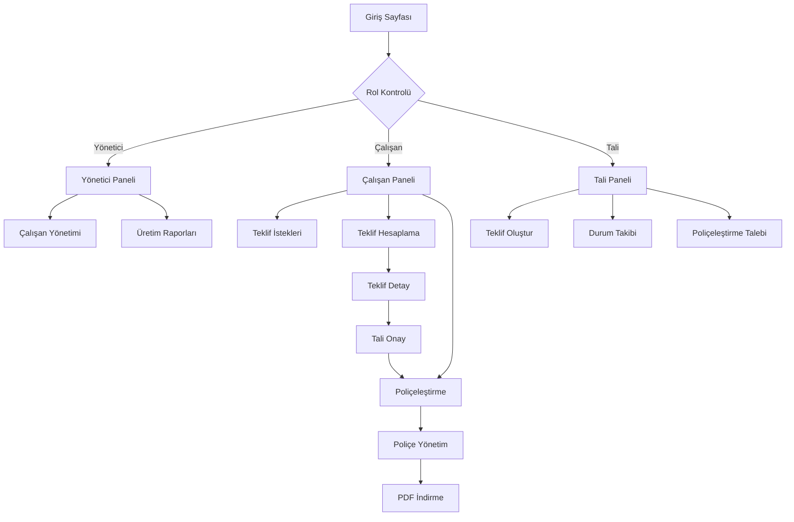

## 1. Ürün Genel Bakış
Sigorta acentesi yönetim platformu; teklif hesaplama, poliçeleştirme ve üretim raporlama süreçlerini dijitalleştiren kapsamlı bir çözümdür.
- Yöneticiler, çalışanlar ve tali acenteler için özelleştirilmiş iş akışları sunar
- Web tabanlı yapısı ile mobil, tablet ve masaüstü cihazlardan erişim sağlar

## 2. Temel Özellikler

### 2.1 Kullanıcı Rolleri
| Rol | Kayıt Yöntemi | Temel İzinler |
|------|---------------------|------------------|
| Yönetici | Sistem yöneticisi tarafından oluşturulur | Tüm verileri görüntüleme, çalışan ve tali ekleme, üretim raporlarına erişim |
| Çalışan | Yönetici tarafından davet edilir | Teklif hesaplama, poliçeleştirme, tali mesajları yanıtlama |
| Tali Acente | Kendi kayıt olur, yönetici onayı gerekir | Teklif isteği oluşturma, poliçeleştirme talebi gönderme, durum takibi |

### 2.2 Özellik Modülü
Sigorta acentesi uygulaması aşağıdaki temel sayfalardan oluşur:
1. **Giriş Sayfası**: Kullanıcı girişi, rol bazlı yönlendirme
2. **Yönetici Paneli**: Genel istatistikler, çalışan yönetimi, üretim raporları
3. **Çalışan Paneli**: Teklif istekleri, poliçeleştirme talepleri, üretim takibi
4. **Tali Paneli**: Teklif oluşturma, durum takibi, poliçeleştirme talebi
5. **Teklif Detay Sayfası**: Teklif hesaplama, fiyat karşılaştırması
6. **Poliçe Yönetim Sayfası**: PDF yükleme, durum güncelleme, paylaşım

### 2.3 Sayfa Detayları
| Sayfa Adı | Modül Adı | Özellik Açıklaması |
|-----------|-------------|---------------------|
| Giriş Sayfası | Kimlik Doğrulama | Email ve şifre ile giriş yap, rol bazlı dashboard'a yönlendir |
| Yönetici Paneli | Genel İstatistikler | Toplam çalışan sayısı, aktif çalışanlar, aylık/haftalık/günlük üretim raporları görüntüle |
| Yönetici Paneli | Çalışan Yönetimi | Yeni çalışan ekle, çalışan performanslarını görüntüle, yetkileri düzenle |
| Yönetici Paneli | Üretim Raporları | Ürün bazlı (DASK, trafik, kasko) poliçe sayıları, net prim ve komisyon tutarları |
| Çalışan Paneli | Teklif İstekleri | Tali acentelerden gelen teklif isteklerini listele, detaylarını görüntüle |
| Çalışan Paneli | Teklif Hesaplama | Araç bilgilerine göre fiyat teklifi hesapla, en uygun fiyatı belirle, not ekle |
| Çalışan Paneli | Poliçeleştirme | Tali talebini onayla, poliçe PDF'i yükle, durumu güncelle |
| Çalışan Paneli | Üretim Takibi | Hesapladığın teklifler, kestiğin poliçeler, aylık/haftalık performans |
| Tali Paneli | Teklif Oluştur | Araç ruhsat bilgilerini gir, teklif isteği oluştur |
| Tali Paneli | Durum Takibi | Teklif durumunu görüntüle (bekleniyor, bakılıyor, hesaplandı) |
| Tali Paneli | Poliçeleştirme Talebi | Hesaplanan teklifi onayla, kart bilgilerini gir, not ekle, talep gönder |
| Tali Paneli | Poliçe İndirme | Hazır poliçe PDF'ini indir veya paylaş |
| Teklif Detay Sayfası | Fiyat Karşılaştırması | Farklı sigorta şirketlerinden gelen teklifleri karşılaştır |
| Poliçe Yönetim Sayfası | PDF Yükleme | Poliçe belgesini sisteme yükle, tali ile paylaş |

## 3. Temel Süreçler

### Yönetici Akışı:
Yönetici giriş yaptıktan sonra genel dashboard'da tüm istatistikleri görür. Çalışan ekleyebilir, mevcut çalışanların performanslarını takip edebilir. Üretim raporlarını ürün, zaman ve personel bazlı inceleyebilir.

### Çalışan Akışı:
Çalışan panelinde tali acentelerden gelen teklif isteklerini görür. Araç bilgilerini inceleyerek fiyat teklifi hesaplar, en uygun fiyatı belirler ve not ekler. Tali onay verirse poliçeleştirme talebi oluşturur, poliçe kesildikten sonra PDF'ini yükler.

### Tali Acente Akışı:
Tali acente müşteri bilgilerini girerek teklif isteği oluşturur. Teklif durumunu takip eder, hesaplanan teklifleri görüntüler. Onay verirse kart bilgilerini girerek poliçeleştirme talebi gönderir. Poliçe hazır olduğunda PDF'ini indirir.

## 4. Kullanıcı Arayüzü Tasarımı

### 4.1 Tasarım Stili
- **Birincil Renk**: #1E40AF (Koyu mavi - güven ve profesyonellik)
- **İkincil Renk**: #F59E0B (Amber - dikkat çekici elementler)
- **Buton Stili**: Yuvarlatılmış köşeler, dolgu (filled) ve çerçeveli (outlined) varyasyonlar
- **Yazı Tipi**: Inter (modern ve okunabilir)
- **Yazı Boyutları**: Başlıklar 24-32px, gövde 14-16px, küçük metin 12px
- **Düzen Stili**: Kart bazlı layout, üst navigasyon çubuğu, yan panel menü
- **İkon Stili**: Material Design ikonları, tutarlı çizgi kalınlığı

### 4.2 Sayfa Tasarımı Genel Bakış
| Sayfa Adı | Modül Adı | UI Elementleri |
|-----------|-------------|-------------|
| Giriş Sayfası | Kimlik Doğrulama Formu | Ortalanmış kart, logo, email/şifre inputları, mavi arka plan |
| Yönetici Paneli | İstatistik Kartları | 4'lü grid layout, ikonlu kartlar, renk kodlu göstergeler, grafikler |
| Çalışan Paneli | Teklif Listesi | Tablo görünümü, durum badge'leri, filtreleme çubuğu, action butonları |
| Tali Paneli | Teklif Formu | Multi-step form, progress bar, dosya yükleme alanı, bilgi kartları |
| Teklif Detay | Fiyat Karşılaştırma | Yan yana kartlar, fiyat vurgusu, şirket logoları, onay butonu |
| Poliçe Yönetim | PDF Önizleme | PDF viewer, indirme butonu, paylaşım seçenekleri, durum bilgisi |

### 4.3 Duyarlılık (Responsiveness)
- **Masaüstü-öncelikli tasarım**: 1920px genişlikte optimum görünüm
- **Tablet adaptasyonu**: 768px-1024px arası grid yeniden düzenlenmesi
- **Mobil optimizasyonu**: 320px-767px arası tek sütun layout, büyütülmüş dokunma hedefleri
- **Breakpoint'ler**: 640px, 768px, 1024px, 1280px
- **Dokunma etkileşimi**: Swipe gestures mobil listelerde, büyük butonlar, hover efektleri yerine tık efektleri