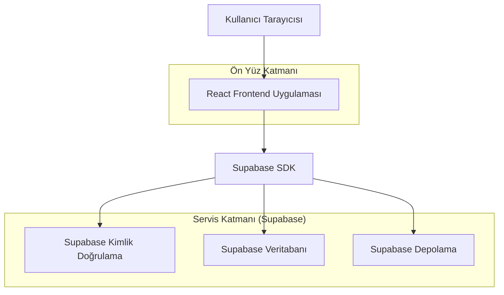
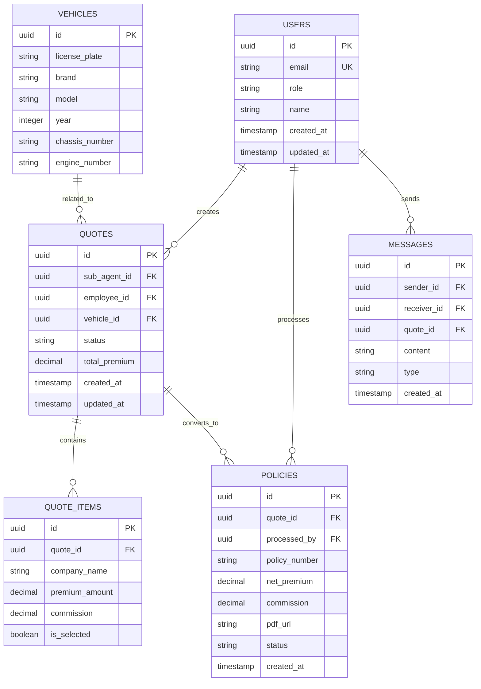

## 1. Mimarisi Tasarımı



## 2. Teknoloji Açıklaması
- **Ön Yüz**: React@18 + tailwindcss@3 + vite
- **Başlatma Aracı**: vite-init
- **Backend**: Supabase (Kimlik doğrulama, veritabanı, dosya depolama)
- **Veritabanı**: PostgreSQL (Supabase üzerinde)
- **Kimlik Doğrulama**: Supabase Auth
- **Dosya Depolama**: Supabase Storage (poliçe PDF'leri için)

## 3. Rota Tanımları
| Rota | Amaç |
|-------|---------|
| /login | Giriş sayfası, kullanıcı kimlik doğrulaması |
| /admin/dashboard | Yönetici paneli, genel istatistikler ve raporlar |
| /admin/employees | Çalışan yönetimi sayfası |
| /employee/dashboard | Çalışan paneli, teklif istekleri ve üretim bilgileri |
| /employee/quotes | Teklif hesaplama ve yönetim sayfası |
| /employee/policies | Poliçeleştirme talepleri sayfası |
| /sub-agent/dashboard | Tali acente paneli, teklif durum takibi |
| /sub-agent/quotes/new | Yeni teklif isteği oluşturma |
| /sub-agent/quotes | Mevcut teklif istekleri listesi |
| /sub-agent/policies | Poliçe indirme ve yönetim sayfası |
| /quote/:id | Teklif detay ve karşılaştırma sayfası |
| /policy/:id | Poliçe görüntüleme ve indirme sayfası |

## 4. Veri Modeli

### 4.1 Veri Modeli Tanımı


### 4.2 Veri Tanım Dili (DDL)

**Kullanıcılar Tablosu (users)**
```sql
-- tablo oluşturma
CREATE TABLE users (
  id UUID PRIMARY KEY DEFAULT gen_random_uuid(),
  email VARCHAR(255) UNIQUE NOT NULL,
  password_hash VARCHAR(255) NOT NULL,
  name VARCHAR(100) NOT NULL,
  role VARCHAR(20) NOT NULL CHECK (role IN ('admin', 'employee', 'sub_agent')),
  created_at TIMESTAMP WITH TIME ZONE DEFAULT NOW(),
  updated_at TIMESTAMP WITH TIME ZONE DEFAULT NOW()
);

-- indeksler
CREATE INDEX idx_users_email ON users(email);
CREATE INDEX idx_users_role ON users(role);
```

**Araçlar Tablosu (vehicles)**
```sql
-- tablo oluşturma
CREATE TABLE vehicles (
  id UUID PRIMARY KEY DEFAULT gen_random_uuid(),
  license_plate VARCHAR(20) NOT NULL,
  brand VARCHAR(50) NOT NULL,
  model VARCHAR(50) NOT NULL,
  year INTEGER NOT NULL,
  chassis_number VARCHAR(50),
  engine_number VARCHAR(50),
  created_at TIMESTAMP WITH TIME ZONE DEFAULT NOW()
);

-- indeksler
CREATE INDEX idx_vehicles_license ON vehicles(license_plate);
```

**Teklifler Tablosu (quotes)**
```sql
-- tablo oluşturma
CREATE TABLE quotes (
  id UUID PRIMARY KEY DEFAULT gen_random_uuid(),
  sub_agent_id UUID REFERENCES users(id),
  employee_id UUID REFERENCES users(id),
  vehicle_id UUID REFERENCES vehicles(id),
  status VARCHAR(20) DEFAULT 'pending' CHECK (status IN ('pending', 'processing', 'calculated', 'accepted', 'rejected')),
  total_premium DECIMAL(10,2),
  notes TEXT,
  created_at TIMESTAMP WITH TIME ZONE DEFAULT NOW(),
  updated_at TIMESTAMP WITH TIME ZONE DEFAULT NOW()
);

-- indeksler
CREATE INDEX idx_quotes_sub_agent ON quotes(sub_agent_id);
CREATE INDEX idx_quotes_employee ON quotes(employee_id);
CREATE INDEX idx_quotes_status ON quotes(status);
CREATE INDEX idx_quotes_created ON quotes(created_at DESC);
```

**Teklif Kalemleri Tablosu (quote_items)**
```sql
-- tablo oluşturma
CREATE TABLE quote_items (
  id UUID PRIMARY KEY DEFAULT gen_random_uuid(),
  quote_id UUID REFERENCES quotes(id),
  company_name VARCHAR(100) NOT NULL,
  premium_amount DECIMAL(10,2) NOT NULL,
  commission DECIMAL(10,2) NOT NULL,
  is_selected BOOLEAN DEFAULT FALSE,
  created_at TIMESTAMP WITH TIME ZONE DEFAULT NOW()
);

-- indeksler
CREATE INDEX idx_quote_items_quote ON quote_items(quote_id);
```

**Poliçeler Tablosu (policies)**
```sql
-- tablo oluşturma
CREATE TABLE policies (
  id UUID PRIMARY KEY DEFAULT gen_random_uuid(),
  quote_id UUID REFERENCES quotes(id),
  processed_by UUID REFERENCES users(id),
  policy_number VARCHAR(50) UNIQUE NOT NULL,
  net_premium DECIMAL(10,2) NOT NULL,
  commission DECIMAL(10,2) NOT NULL,
  pdf_url TEXT,
  status VARCHAR(20) DEFAULT 'pending' CHECK (status IN ('pending', 'issued', 'cancelled')),
  created_at TIMESTAMP WITH TIME ZONE DEFAULT NOW(),
  updated_at TIMESTAMP WITH TIME ZONE DEFAULT NOW()
);

-- indeksler
CREATE INDEX idx_policies_quote ON policies(quote_id);
CREATE INDEX idx_policies_processor ON policies(processed_by);
CREATE INDEX idx_policies_status ON policies(status);
CREATE INDEX idx_policies_created ON policies(created_at DESC);
```

**Mesajlar Tablosu (messages)**
```sql
-- tablo oluşturma
CREATE TABLE messages (
  id UUID PRIMARY KEY DEFAULT gen_random_uuid(),
  sender_id UUID REFERENCES users(id),
  receiver_id UUID REFERENCES users(id),
  quote_id UUID REFERENCES quotes(id),
  content TEXT NOT NULL,
  type VARCHAR(20) DEFAULT 'info' CHECK (type IN ('info', 'request', 'response')),
  is_read BOOLEAN DEFAULT FALSE,
  created_at TIMESTAMP WITH TIME ZONE DEFAULT NOW()
);

-- indeksler
CREATE INDEX idx_messages_receiver ON messages(receiver_id);
CREATE INDEX idx_messages_quote ON messages(quote_id);
CREATE INDEX idx_messages_created ON messages(created_at DESC);
```

## 5. Supabase Politikaları

**Temel erişim izinleri:**
```sql
-- anon rolüne temel okuma izinleri
GRANT SELECT ON users TO anon;
GRANT SELECT ON quotes TO anon;
GRANT SELECT ON vehicles TO anon;

-- authenticated rolüne tam erişim
GRANT ALL PRIVILEGES ON users TO authenticated;
GRANT ALL PRIVILEGES ON quotes TO authenticated;
GRANT ALL PRIVILEGES ON quote_items TO authenticated;
GRANT ALL PRIVILEGES ON policies TO authenticated;
GRANT ALL PRIVILEGES ON vehicles TO authenticated;
GRANT ALL PRIVILEGES ON messages TO authenticated;
```

**Rol bazlı satır seviyesi güvenlik (RLS):**
```sql
-- Kullanıcılar sadece kendi bilgilerini görebilir
ALTER TABLE users ENABLE ROW LEVEL SECURITY;
CREATE POLICY users_read_policy ON users FOR SELECT 
  USING (auth.uid() = id OR EXISTS (
    SELECT 1 FROM users WHERE id = auth.uid() AND role = 'admin'
  ));

-- Çalışanlar ve taliler sadece kendi tekliflerini görebilir
ALTER TABLE quotes ENABLE ROW LEVEL SECURITY;
CREATE POLICY quotes_access_policy ON quotes FOR ALL 
  USING (
    sub_agent_id = auth.uid() OR 
    employee_id = auth.uid() OR 
    EXISTS (
      SELECT 1 FROM users WHERE id = auth.uid() AND role = 'admin'
    )
  );

-- Mesajlar sadece alıcı ve gönderici tarafından görülebilir
ALTER TABLE messages ENABLE ROW LEVEL SECURITY;
CREATE POLICY messages_access_policy ON messages FOR ALL 
  USING (
    sender_id = auth.uid() OR 
    receiver_id = auth.uid() OR 
    EXISTS (
      SELECT 1 FROM users WHERE id = auth.uid() AND role = 'admin'
    )
  );